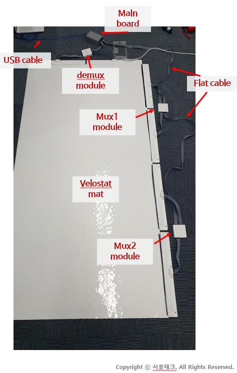
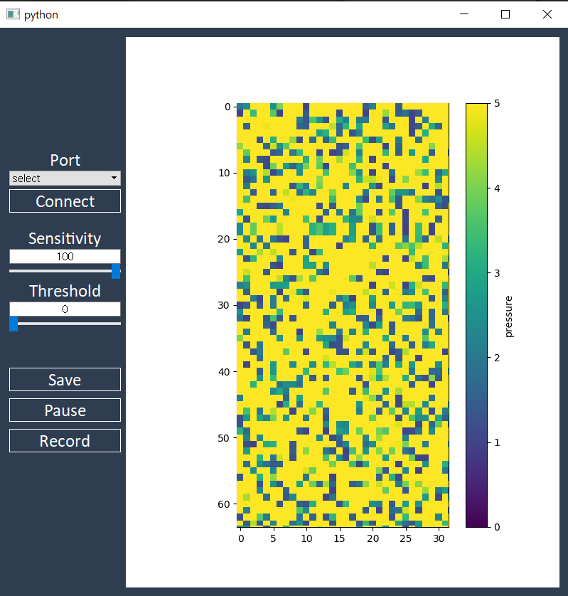
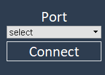
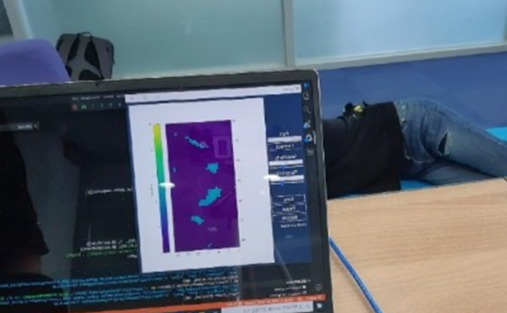
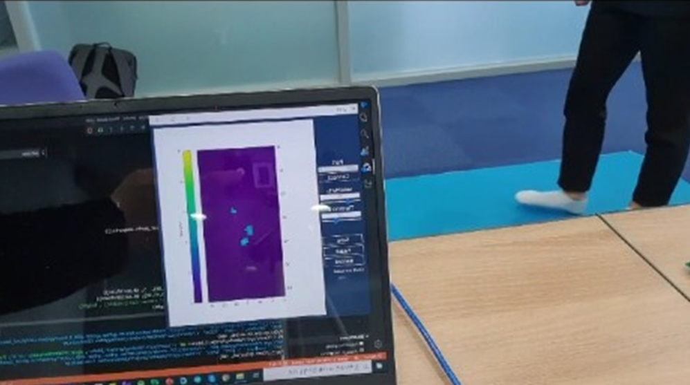

<h1 align = "center">JOBCHO</h1>

 

<h2 align="center">Overview</h2>

This repository has source of project, "JOBCHO". 
"JOBCHO" project is controlling bundle of pressure sensor, made of velostat.

<h2 align="center">Prerequistory</h2>

  velostat mat x 1 
  main board x 1 
  demux module x 2 
  mux module x 1 
  7x2 IDC connector x 3 
  8x2 IDC connector x 6 

<h2 align="center">Quick start</h2>

1. First, you have to connect flat wire to sensor mat. 
   

2. Next, connect USB cable to your computer. 
3. execute ./python files/main.py or execute main.exe file. 
 

4. select your arduino port and press 'connect' button.  
 

5. Now, you can see visualized sensor data. 
   

   

6. adjust two parameter(sensitivity, threshold) to remove noise, and amplify signal. 
Our team found some optimized value for two value. 

  
  <table>
      <thead>
          <tr>
              <th align="center">motion</th>
              <th align="center">sensitivity</th>
              <th align="center">threshold</th>
          </tr>
      </thead>
      <tbody>
          <tr>
              <td align="center">walking</td>
              <td align="center">30</td>
              <td align="center">200</td>
         </tr>
          <tr>
              <td align="center">lying</td>
              <td align="center">40</td>
              <td align="center">200</td>
          </tr>
      </tbody>
  </table>
  

